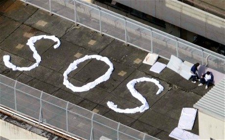
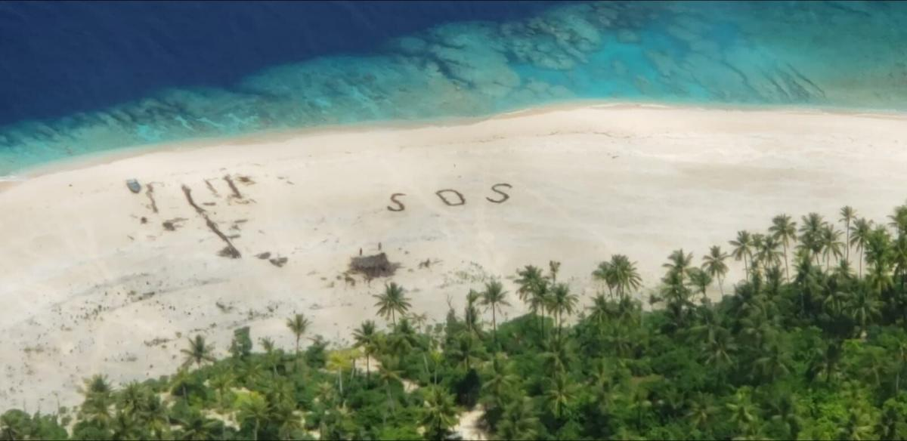

# SOS-Drone
A project to deliver help to anyone travelling, through drones.

## Inspiration
In 2018, tourism was worth about $1.7tn (£1.3tn), or about 2% of total global GDP. In 2019, it was estimated that the number of international tourist arrivals worldwide would reach approximately 1.46 billion. While this was disrupted by COVID in 2020, with the vaccine being released everyone is back to planning their next trips. But there are those who make risky trips - say for example solo travellers or mountain hikers or even skiiers, and it was always better to have some sort of backup resources to guide your way back to safety.

## What it does
Before travelling, a user can enter their trip details and mobile number on our app, while they keep their location switched on. In case of any emergency, the user can simply click on SOS on our app, and our drone containing resources to help you will come to the aid!

In case you lose your mobile phone, are not carrying it with you or don't have battery - worry not. Simply write SOS if any of the resources available around you, it can be sticks, stones, sand, snow - literally anything! Our drones in the area use continuous image processing and text detection and will detect your SOS and land to give you the resources necessary!

## How I built it
We built SOS-Drone using Google-cloud's vision API for handwriting recognition, and it works wonderfully to detect text written using in sand, snow, or even using rocks. We then had the realisation of using this API to build something that detects SOS from a distance - which could be done through drones. 

## Results 
<figure>
  
  <figcaption>Confidence of 'SOS' detection is 0.92</figcaption>
</figure>
<figure>
  
  <figcaption>Confidence of 'SOS' detection is 0.61</figcaption>
</figure>

## Challenges I ran into
I first planned to make my own deep learning model to detect SOS text using images available on the internet, but unfortunately that would take too much time and none of our team members have experience with Deep Learning. Then we explored the Google Cloud APIs, and that's where I came across the Vision API. It has a surprisingly high accuracy!

## Accomplishments that I'm proud of
It was my first time using an API, so I feel really happy that I could get it to work. We have a good working model as well as a beautiful presentation and app prototype designed. We did this all in less than 24 hours so we're really happy about it.

## What I learned
I learnt about the tourism industry and the risks associated while travelling. I learnt how to coordinate with team members and bounce ideas off each other. Mostly importantly I learnt how to use an API. 

## What's next for SOSDrone
We are planning to work on building our own drone by building a CAD model in Fusion360 and 3D Printing it. Then we plan to make a drone simulation in MATLAB. Firstly we will figure out the resources which an individual will need depending on their trip. We would also need to calculate the max payload that our drone can handle. Regulations regarding drone technology are definitely going to be something that will restrict our product, so we need to research them to ensure our product reaches market. A lot of optimisation algorithms will be explored to ensure our resources are not wasted. Additionally we will need to improve our model by generating our own proprietary dataset.
